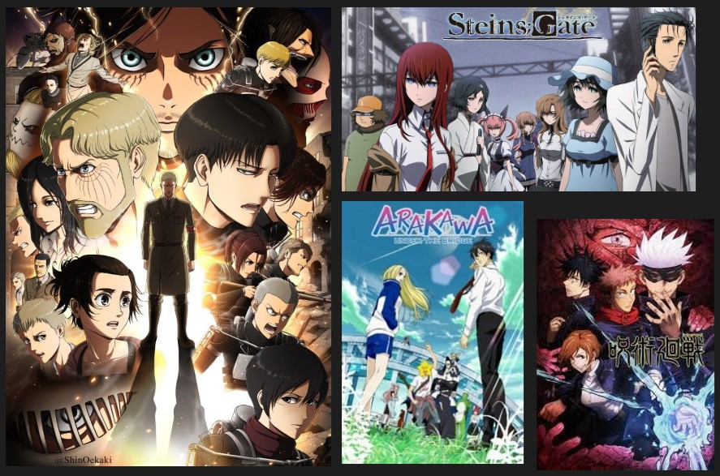
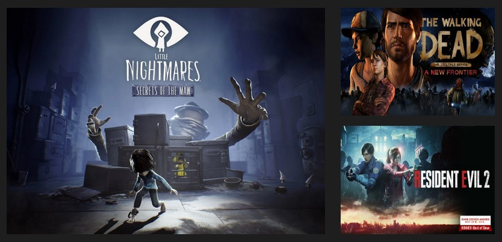

# Kenny's User Page

## Favorite Programming Language:

  

 

`print('Python is really easy to use and is very versatile')`

 

_Why Python?_
- large libraries
  - almost every API I've used has python supported
- great for collecting data and automating tasks
- beginner friendly and easy to read syntax

## Some of my Favorite Anime:
- **Attack on Titan**
- **Steins Gate**
- **Jujutsu Kaisen**
- **Arakawa Under The Bridge**

  

## Most recent Programming Project that I've worked on:

- Reddibot is a discord bot that fetches images from your favorite subreddits

> Click [here](https://www.reddibot.me/) to add Reddibot to your Discord server!

  

## Some Games I've played recently:

- [ ] **Resident Evil 2**

- [x] **The Walking Dead**

- [ ] **Little Nightmares: Secrets of the Maw**

  

